# [Image Classification Using Transfer Learning on ResNet152 Model](https://github.com/kbolon1/Diabetic_Retinopathy_Image_Classifier)

**Final project for Spiced Academy** 

The number of cases and the prevalence of diabetes have been steadily increasing over the past few decades with approximately 422 million people diagnosed worldwide. Diabetic retinopathy is a complication of diabetes, caused by high blood sugar levels that damage the back of the eye.  It can cause blindness if left undiagnosed and untreated.  It is also the leading cause of vision impairment in the world and is 100% avoidable.

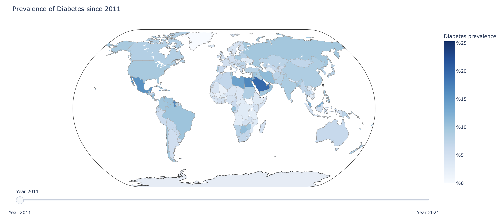
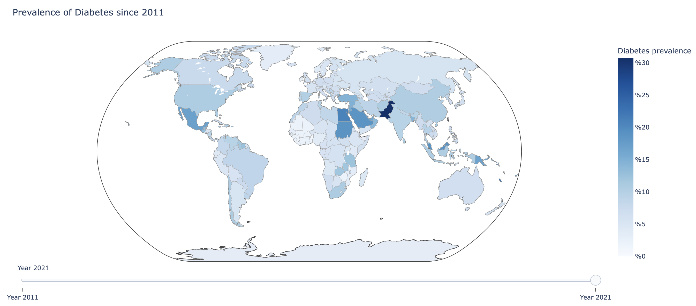

Used Plotly with data pulled from the World Bank (https://databank.worldbank.org/home.aspx)

Over the years, computer-aided diagnosis have decreased medical costs and improved mass screening of populations.  AI helps doctors and clinicians utilise their time more efficiently by diagnosing through imaging and decreasing the amount time doctors are needed during the diagnosing period and they can spend more time treating people.

**Goal** 
Can I train an unsupervised machine learning model to accurately diagnose a digital image of an eye suffering from diabetic retinopathy?

**Models Used** 
ResNet152 Neural Network model with transfer learning with the following parameters:
 - loss=‘categorical_crossentropy'
 - Optimiser: Adam
 - Mix of Relu and Softmax Activations
 - 2 Classes 'diabetic' or 'healthy'
 - Epochs 300, no early stopping

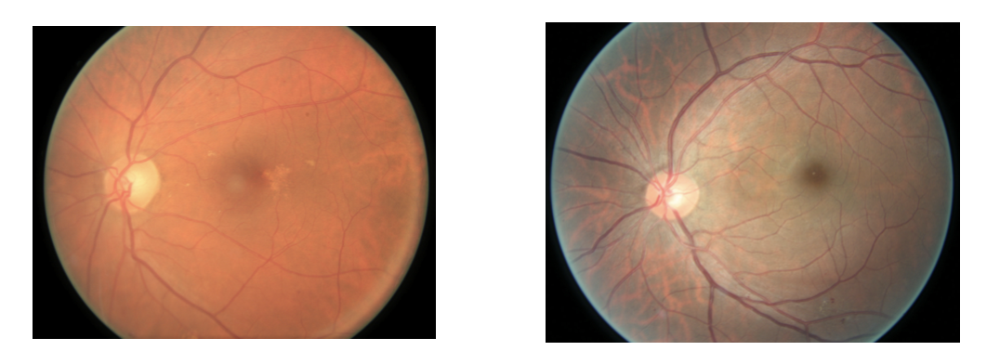

I used the unprocessed images found on Kaggle:
 - https://www.kaggle.com/competitions/diabetic-retinopathy-detection
 - https://www.kaggle.com/competitions/aptos2019-blindness-detection
 - https://www.kaggle.com/datasets/andrewmvd/ocular-disease-recognition-odir5k

**Method:**
* Created a Deep-Learning Environment for Tensorflow and Keras and transfered the work to Google Colab as the sample sizes were too large for my computer to handle.
* Used Keras Preprocessing on the images to resize and to augment
* Built my own CNN model with 3 Convoluted layers with MaxPooling, a Flattening layer, and 3 Dense Layers with Dropout and Batch Normalization while using a mix of RELU and Sigmoid activations and selected Categorical_crossentropy for loss function.
* Tried a VGG19 model and then a ResNet152 model with transfer learning. Eventually trained it on a sample of 5000 images of each class with only 50% accuracy rate. 

**Currently:**
I have started over and changed the model to use the LazyAdam optimizer and will process the images differently.  I am researching best ways to preprocess the images.  Stay tuned for updates.

____

# [Markov Chain Monte Carlo: Predicting Customer Behavior](https://github.com/kbolon1/MCMC_Supermarket)

* Created a simulation of customer behavior in a supermarket using Markov-Chain Monte Carlo methods.
* Used Pandas and NumPy for data wrangling, calculated a transition probabilities matrix, implemented a customer class, and then run a MCMC simulation for customer(s).

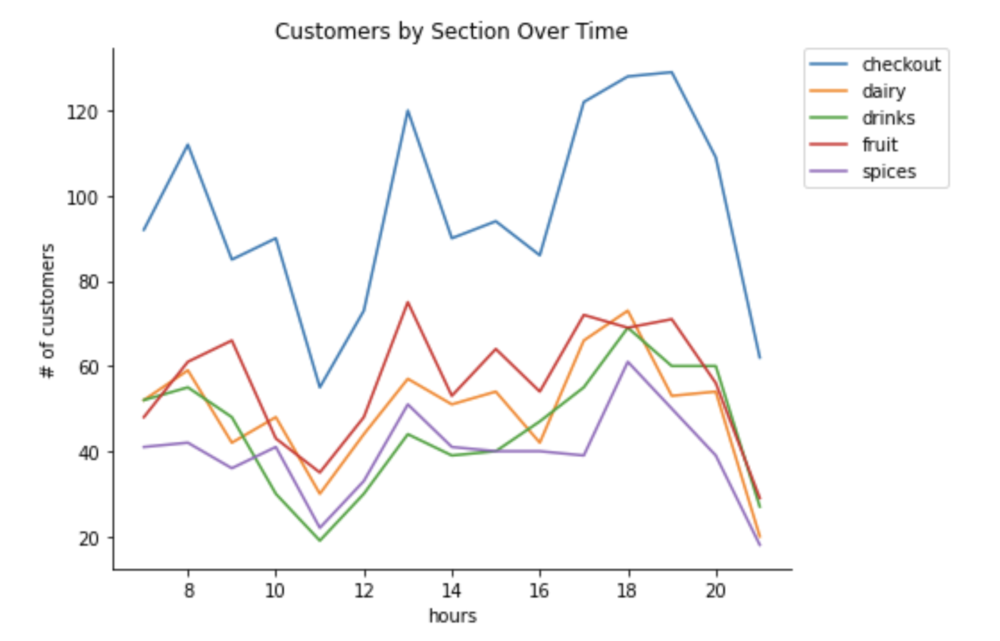

____

# [Recommender Systems: Movie Recommender](https://github.com/kbolon1/Movie_Recommender)

* Built a web application that showcases movie recommendations using the small version of the MovieLens-dataset (https://grouplens.org/datasets/movielens/)
* Performed data engineering on missing data(KNN Imputer, Mean Movie Ratings).
* Implemented the following models trying to find the lowest Mean Error :
    - Simple recommender based on correlations
    - Non-Negative Matrix Factorization model
    - KMeans (clustering)
    - Nearest Neighbour
* Wrote a flask web interface and connected the recommender-model to flask

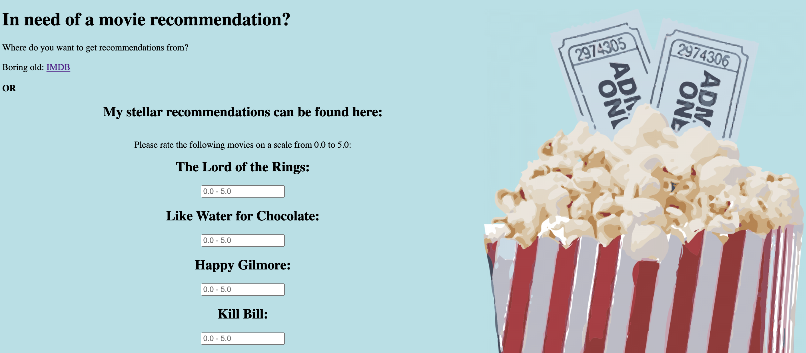
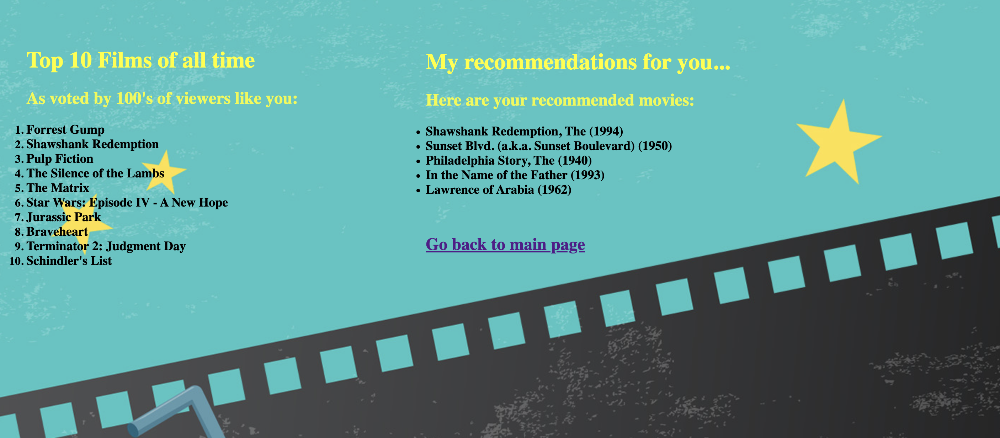

	
____

# [Text Classification Project: Webscraping Lyrics](https://github.com/kbolon1/Web_Scraper)

* Built a text classification model on song lyrics, the following was performed: 
    - Downloaded an HTML page with links to songs (https://www.lyrics.com)
    - Parsed HTML for hyperlinks to extract and download song lyrics
    - Vectorized the text using the Bag Of Words method and normalised the word counts with term frequency-inverse document frequency (TF-IDF)
    - Trained a classification model (Logistic Regression, Naive Bayes/MultinomialNB) that predicts the artist from a piece of text
    - Created a shaped WordCloud for each artist

* Used Python, BeautifulSoup, RegEx, Glob, Pillow, WordCloud, Seaborn, NumPy, Pandas, SciKit-Learn

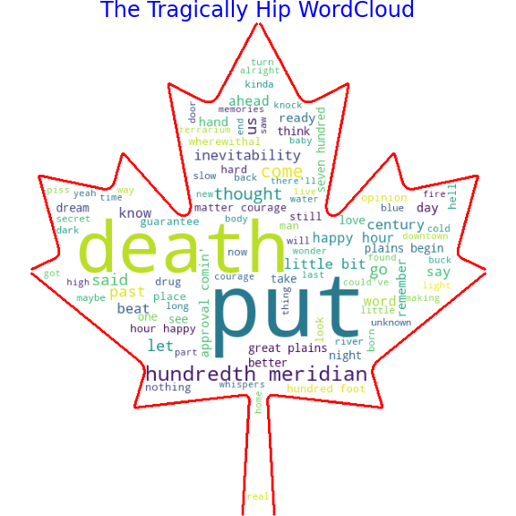    
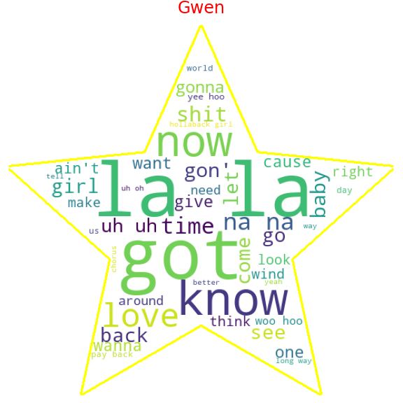  

____

# [Sentiment Analysis Project: Twitter API (Docker and MongoDB](https://github.com/kbolon1/Twitter_Pipeline)

* Spiced Academy Project

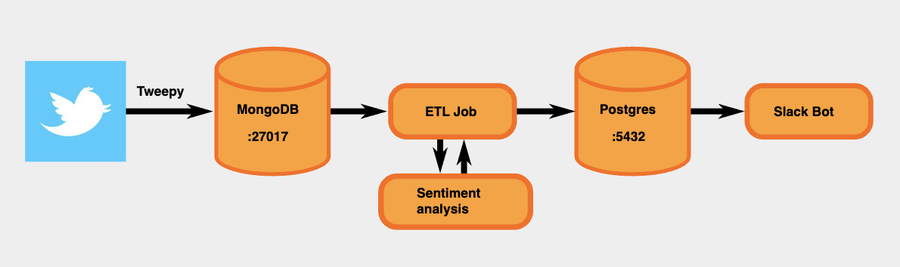 

* Used Python, MongoDB, Tweeter APIs, tweepy, Docker.
* Built a data pipeline with Docker-compose that collected tweets and stored them in a MongoDB database. 
* Created an ETL job that pulled the tweets from MongoDB, cleans data and calculates compound sentiment score (Vader Sentiment Analysis) for sentiment analysis and then stored the analysed tweets on a second database (PostgreSQL).

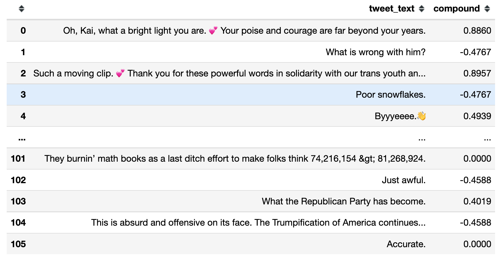 

____

# [Project: Short-Term Weather Forecast-Time Series Analysis](https://github.com/kbolon1/Time_Series_Analysis)

* Created a short-term temperature forecast using data from (www.ecad.eu).
* Built a baseline model modelling trend and seasonality, plotted and inspected the different components of a time series.
* Used the following models to model the time dependence of the remainder:
    - Linear Regression
    - Autoregression
    - Auto Regressive Integreated Moving Average (ARIMA)
* Evaluated the model using Cross-Validation Time Series Split

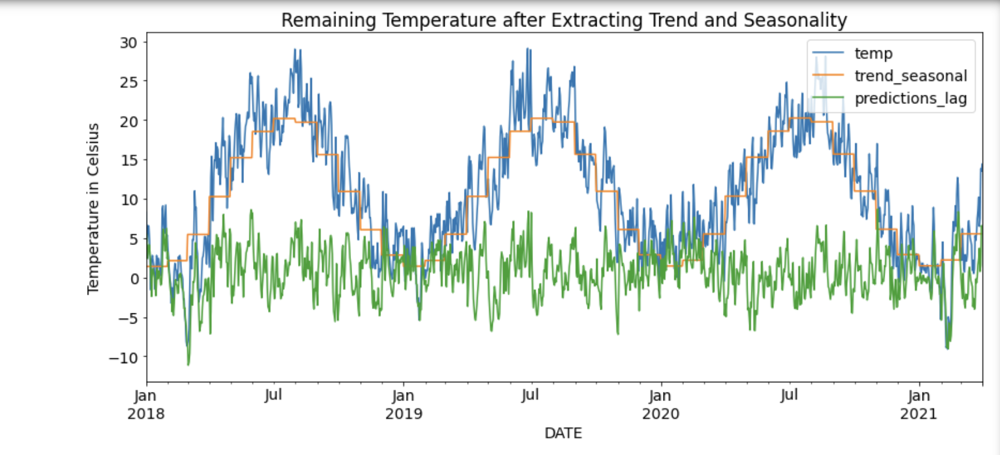 
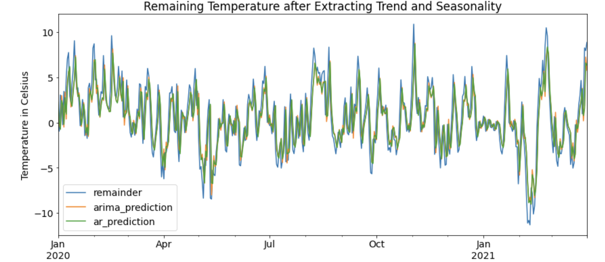 

____

# [Visual Data Analysis: Gapminder Data with GIFs of Fertility Rate vs Life Expectancy](https://github.com/kbolon1/Gapminder)

* Collected data from gapminder project (https://www.gapminder.org/data/)

* Used python, pandas, seaborn, matplotlib, and NumPy to wrangle and explore data
* Created GIF using Seaborn and ImageIO showing fertility rate vs life expectancy between 1960 - 2016

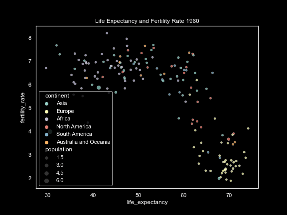

____

# [Classification Project: Titanic Dataset (Predicting Survival Rates)](https://github.com/kbolon1/Titanic_Dataset)

* Used python, pandas, seaborn, NymPy, matplotlib, sklearn
* Collected data from Kaggle (https://www.kaggle.com/c/titanic)
* Implemented and compared a variety of Machine Learning classifiers with scikit-learn (logistic regression, support vector machine, random forest) to predict survival of passengers on the Titanic

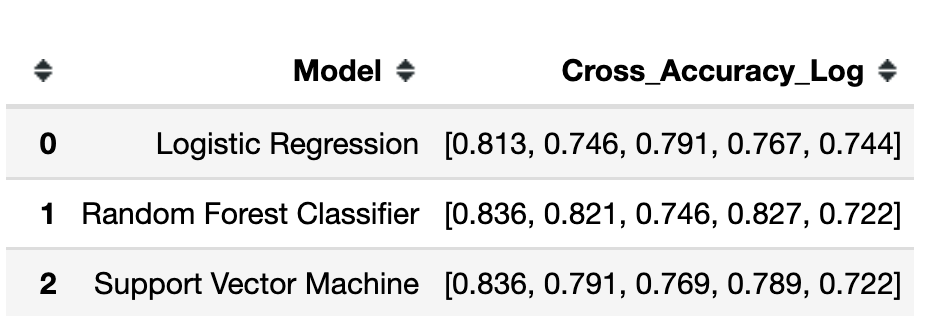

* Project consisted of all phases of Machine Learning work-flow: 
    - train-test-splitting of data, 
    - data exploration, 
    - feature engineering, 
    - optimization of hyperparameters, 
    - evaluation of models with cross-validation.

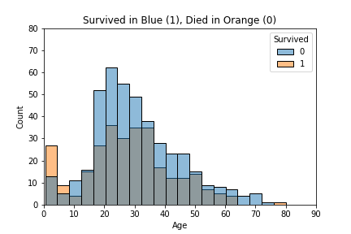

	
____

# [Regression Analysis Project: Capital Bike Sharing](https://github.com/kbolon1/Regression_Analysis)

* Used Python, Pandas, NumPy, Matplotlib, Seaborn, math, SciKit-Learn 
* Built and trained a regression model on the Capital Bike Share (Washington, D.C.) from the Kaggle data set (https://www.kaggle.com/competitions/bike-sharing-demand/data) to predict demand for bicycle rentals at any given hour based on time and weather
* Imported and cleaned data, performed exploratory data analysis (EDA) 

	
	
* Performed Data Engineering using Pipelines, ColumnTransformer, OneHotEncoder, MinMaxScaler, StandardScaler, and RobustScaler
* Trained regression models (Random Forest Regression, Linear Regression, Polynomial Regression, Cross Validation) to find the best Root Mean Squared Log Error (RMSLE)  
* Used Hyperparameter Optimization on Random Forest Regression Model and GridSearchCV then ElasticNet to regularise the model to prevent overfitting

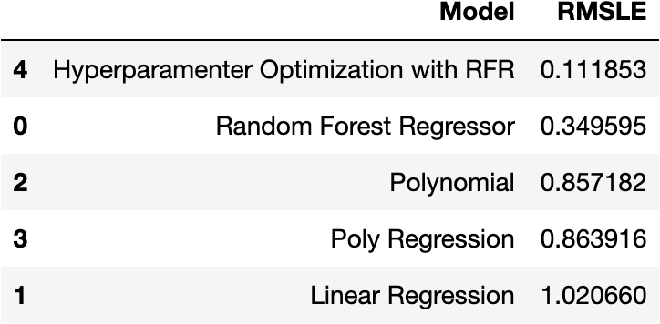

	
____

# [Image Classification: Neural Networks Using Webcam](https://github.com/kbolon1/Image_Classification_Webcam)

* Built an image classifier by collecting photos through a webcam to make predictions on images
* Used Python, NumPy, Pillow, Seaborn, CV2, Glob, SciKit-Learn, TensorFlow, and Keras
* Created a deep learning environment to run tensorflow and keras
* Built a neural network from scratch and then used transfer learning with a pretrained model (MobileNetV2) with transfer learning

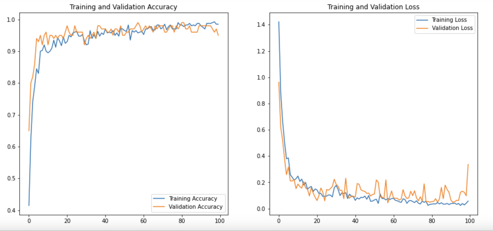

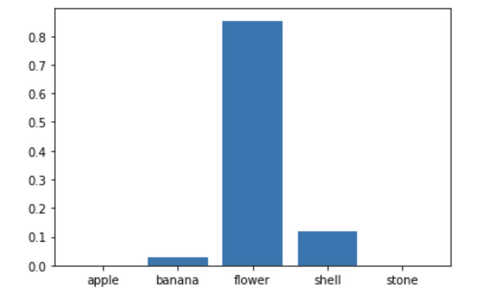

____

# [Project: Dashboard using Northwind Database (AWS/EC2/Ubuntu/Metabase)](https://github.com/kbolon1/Dashboard_PostgreSQL)

* Built a dashboard summarizing the Northwind Database (a sample database from Microsoft Access). 
* Used PostgreSQL to create tables in database (data modeling), uploaded the data AWS EC2 Ubuntu server and then connected to Metabase to create a Dashboard.
